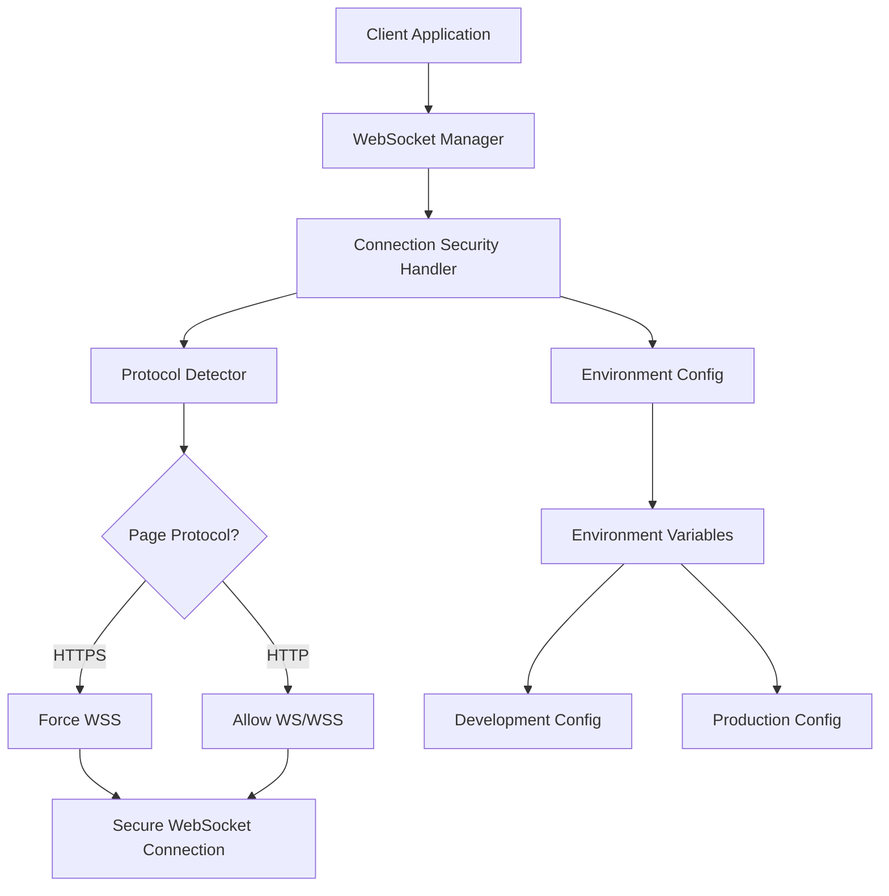

# Design Document

## Overview

The WebSocket connection failure occurs because the Nakama JavaScript client library constructs WebSocket URLs using the `ws://` protocol even when SSL is enabled, causing Mixed Content Policy violations when the client application is served over HTTPS. This design addresses the issue by implementing a secure WebSocket connection strategy that automatically selects the appropriate protocol based on the deployment environment and page security context.

## Architecture

### Current Problem Analysis

1. **Root Cause**: The Nakama client library constructs WebSocket URLs as `ws://host:port/ws` regardless of SSL settings
2. **Security Violation**: HTTPS pages cannot connect to insecure WebSocket endpoints (`ws://`)
3. **Environment Mismatch**: Production environment requires `wss://` but client defaults to `ws://`

### Solution Architecture



## Components and Interfaces

### 1. WebSocket Manager

**Purpose**: Centralized WebSocket connection management with automatic protocol selection

**Interface**:
```typescript
interface WebSocketManager {
  createSecureSocket(session: Session, useSSL: boolean): Socket;
  getWebSocketUrl(host: string, port: string, useSSL: boolean): string;
  validateConnection(url: string): Promise<boolean>;
}
```

**Responsibilities**:
- Detect page protocol (HTTP/HTTPS)
- Automatically upgrade to WSS when required
- Handle connection retries with protocol fallback
- Provide connection status feedback

### 2. Connection Security Handler

**Purpose**: Enforce security policies for WebSocket connections

**Interface**:
```typescript
interface ConnectionSecurityHandler {
  validateProtocol(pageProtocol: string, wsProtocol: string): boolean;
  upgradeToSecure(url: string): string;
  detectMixedContentViolation(error: Error): boolean;
}
```

**Responsibilities**:
- Validate WebSocket protocol against page protocol
- Automatically upgrade insecure connections
- Detect and handle Mixed Content Policy violations
- Log security-related connection issues

### 3. Environment Config

**Purpose**: Manage environment-specific WebSocket configuration

**Interface**:
```typescript
interface EnvironmentConfig {
  getWebSocketConfig(): WebSocketConfig;
  isProduction(): boolean;
  shouldForceSSL(): boolean;
}

interface WebSocketConfig {
  host: string;
  port: string;
  useSSL: boolean;
  protocol: 'ws' | 'wss';
}
```

**Responsibilities**:
- Load environment-specific settings
- Determine appropriate WebSocket protocol
- Handle Railway.app specific configuration
- Provide fallback configurations

## Data Models

### WebSocket Configuration Model

```typescript
interface WebSocketConnectionConfig {
  host: string;
  port: string;
  useSSL: boolean;
  protocol: 'ws' | 'wss';
  timeout: number;
  retryAttempts: number;
  retryDelay: number;
}

interface ConnectionAttempt {
  url: string;
  protocol: string;
  timestamp: Date;
  success: boolean;
  error?: string;
}

interface ConnectionStatus {
  connected: boolean;
  protocol: string;
  attempts: ConnectionAttempt[];
  lastError?: string;
}
```

## Error Handling

### 1. Mixed Content Policy Violations

**Detection Strategy**:
- Monitor WebSocket connection errors for security-related messages
- Check for "Mixed Content" or "insecure WebSocket" error patterns
- Validate page protocol vs WebSocket protocol mismatch

**Recovery Strategy**:
- Automatically retry with upgraded protocol (ws:// → wss://)
- Log the protocol upgrade for debugging
- Provide user feedback about connection security requirements

### 2. Connection Failures

**Retry Logic**:
```typescript
const retryStrategy = {
  maxAttempts: 3,
  delays: [1000, 2000, 4000], // Exponential backoff
  protocols: ['wss', 'ws'], // Try secure first, fallback to insecure in dev
};
```

**Error Classification**:
- Security errors (Mixed Content Policy)
- Network errors (connection refused, timeout)
- Authentication errors (invalid credentials)
- Server errors (503, 502, etc.)

### 3. Environment-Specific Handling

**Production Environment**:
- Enforce WSS connections only
- No fallback to insecure protocols
- Detailed error logging for debugging

**Development Environment**:
- Allow both WS and WSS protocols
- Provide helpful error messages
- Enable connection debugging

## Testing Strategy

### 1. Unit Tests

**WebSocket Manager Tests**:
- Protocol detection logic
- URL construction with different configurations
- Error handling for various failure scenarios

**Connection Security Handler Tests**:
- Mixed Content Policy violation detection
- Protocol upgrade functionality
- Security validation logic

### 2. Integration Tests

**Environment Configuration Tests**:
- Verify correct configuration loading for each environment
- Test Railway.app specific settings
- Validate fallback behavior

**End-to-End Connection Tests**:
- Test WebSocket connections in different environments
- Verify automatic protocol upgrades
- Test connection recovery after failures

### 3. Manual Testing Scenarios

**Production Deployment**:
- Deploy to Vercel and verify WSS connections work
- Test connection from HTTPS pages
- Verify no Mixed Content Policy violations

**Development Environment**:
- Test local development with HTTP pages
- Verify WS connections work locally
- Test SSL certificate handling in development

## Implementation Approach

### Phase 1: WebSocket URL Construction Fix
- Modify Nakama client initialization to use correct protocol
- Implement automatic protocol detection based on page context
- Add environment-specific WebSocket URL construction

### Phase 2: Connection Security Enhancement
- Implement Connection Security Handler
- Add Mixed Content Policy violation detection
- Create automatic protocol upgrade mechanism

### Phase 3: Error Handling and Recovery
- Implement comprehensive error handling
- Add connection retry logic with exponential backoff
- Create user-friendly error messages and status indicators

### Phase 4: Environment Configuration
- Enhance environment variable handling
- Add Railway.app specific configuration logic
- Implement configuration validation and fallbacks

## Security Considerations

### 1. Protocol Enforcement
- Always use WSS in production environments
- Prevent downgrade attacks by validating protocol consistency
- Log all protocol upgrade attempts for security monitoring

### 2. Certificate Validation
- Ensure proper SSL certificate validation for WSS connections
- Handle self-signed certificates in development environments
- Provide clear error messages for certificate issues

### 3. Connection Monitoring
- Log all connection attempts with timestamps
- Monitor for unusual connection patterns
- Implement rate limiting for connection attempts

## Performance Considerations

### 1. Connection Efficiency
- Minimize connection retry delays while maintaining reliability
- Implement connection pooling where appropriate
- Cache successful connection configurations

### 2. Error Recovery Speed
- Fast detection of Mixed Content Policy violations
- Immediate protocol upgrade without user intervention
- Minimal delay between retry attempts

### 3. Resource Management
- Proper cleanup of failed WebSocket connections
- Memory management for connection attempt history
- Efficient error logging without performance impact