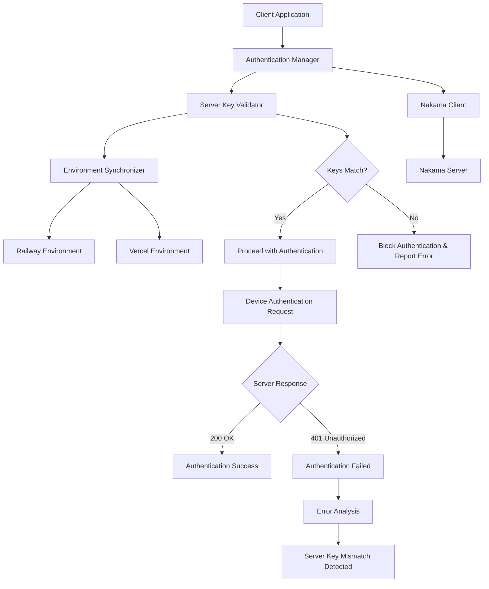

# Design Document

## Overview

The Nakama authentication failure occurs due to a server key mismatch between the client application and the Nakama server. The client is configured with one server key while the server expects a different key, resulting in 401 Unauthorized responses during device authentication. This design addresses the issue by implementing server key validation, environment synchronization, and robust authentication error handling.

## Architecture

### Current Problem Analysis

1. **Root Cause**: Server key mismatch between client environment variables and server configuration
2. **Authentication Failure**: Nakama server rejects authentication requests with 401 Unauthorized
3. **Environment Inconsistency**: Railway backend and Vercel frontend have different server key configurations
4. **Configuration Visibility**: Limited visibility into which server key is being used during authentication

### Solution Architecture



## Components and Interfaces

### 1. Authentication Manager

**Purpose**: Centralized authentication handling with server key validation

**Interface**:

```typescript
interface AuthenticationManager {
  authenticateDevice(deviceId?: string): Promise<Session>;
  validateServerKey(): Promise<boolean>;
  getAuthenticationStatus(): AuthenticationStatus;
  retryAuthentication(maxAttempts: number): Promise<Session>;
}

interface AuthenticationStatus {
  isAuthenticated: boolean;
  serverKeyValid: boolean;
  lastError?: string;
  attempts: number;
}
```

**Responsibilities**:

- Validate server key before authentication attempts
- Handle authentication retries with proper error classification
- Provide detailed authentication status and error reporting
- Manage authentication session lifecycle

### 2. Server Key Validator

**Purpose**: Ensure server key consistency between client and server

**Interface**:

```typescript
interface ServerKeyValidator {
  validateKey(clientKey: string, serverKey?: string): ValidationResult;
  maskKey(key: string): string;
  detectKeyMismatch(error: Error): boolean;
  generateKeyReport(): KeyValidationReport;
}

interface ValidationResult {
  isValid: boolean;
  error?: string;
  recommendation?: string;
}

interface KeyValidationReport {
  clientKey: string; // masked
  serverKeyPresent: boolean;
  environmentsChecked: string[];
  lastValidation: Date;
}
```

**Responsibilities**:

- Compare client and server key configurations
- Detect authentication failures caused by key mismatches
- Provide masked logging for security
- Generate validation reports for debugging

### 3. Environment Synchronizer

**Purpose**: Manage environment variable consistency across deployments

**Interface**:

```typescript
interface EnvironmentSynchronizer {
  checkEnvironmentSync(): Promise<SyncStatus>;
  getEnvironmentConfig(environment: string): EnvironmentConfig;
  validateRequiredVariables(): ValidationResult[];
  generateSyncReport(): SyncReport;
}

interface SyncStatus {
  inSync: boolean;
  missingVariables: string[];
  mismatchedVariables: string[];
  environments: EnvironmentConfig[];
}

interface EnvironmentConfig {
  name: string;
  serverKey: string; // masked
  host: string;
  port: string;
  useSSL: boolean;
}
```

**Responsibilities**:

- Compare environment variables across Railway and Vercel
- Identify missing or mismatched configuration
- Provide synchronization guidance
- Generate environment reports

## Data Models

### Authentication Configuration Model

```typescript
interface AuthenticationConfig {
  serverKey: string;
  host: string;
  port: string;
  useSSL: boolean;
  timeout: number;
  maxRetries: number;
  retryDelay: number;
}

interface AuthenticationAttempt {
  timestamp: Date;
  serverKey: string; // masked
  host: string;
  success: boolean;
  responseStatus?: number;
  error?: string;
  duration: number;
}

interface AuthenticationSession {
  token: string;
  userId: string;
  username: string;
  created: Date;
  expires: Date;
  serverKey: string; // masked
}
```

## Error Handling

### 1. Server Key Mismatch Detection

**Detection Strategy**:

- Monitor 401 Unauthorized responses from authentication endpoints
- Analyze error messages for server key validation failures
- Compare expected vs actual server key configurations

**Recovery Strategy**:

```typescript
const keyMismatchRecovery = {
  immediate: [
    'Validate client server key configuration',
    'Check Railway environment variables',
    'Verify Vercel environment variables',
  ],
  shortTerm: [
    'Update mismatched environment variables',
    'Redeploy affected services',
    'Test authentication flow',
  ],
  longTerm: [
    'Implement automated key synchronization',
    'Add key rotation procedures',
    'Monitor key consistency',
  ],
};
```

### 2. Authentication Failure Classification

**Error Types**:

- **Server Key Mismatch**: 401 with server key validation error
- **Network Issues**: Connection timeout, DNS resolution failure
- **Server Unavailable**: 503, 502, connection refused
- **Configuration Missing**: Missing environment variables

**Response Strategy**:

```typescript
const errorHandling = {
  serverKeyMismatch: {
    action: 'Block authentication, report configuration error',
    userMessage:
      'Authentication configuration error. Please check server settings.',
    developerMessage:
      'Server key mismatch detected. Verify NAKAMA_SERVER_KEY environment variables.',
  },
  networkError: {
    action: 'Retry with exponential backoff',
    userMessage: 'Connection issue. Retrying...',
    developerMessage: 'Network connectivity issue with Nakama server.',
  },
  serverUnavailable: {
    action: 'Retry with longer delays',
    userMessage: 'Server temporarily unavailable. Please try again.',
    developerMessage: 'Nakama server is not responding. Check server status.',
  },
};
```

### 3. Environment-Specific Handling

**Production Environment**:

- Strict server key validation
- No fallback authentication methods
- Detailed error logging for debugging
- Immediate failure on key mismatch

**Development Environment**:

- Flexible server key validation
- Helpful error messages with configuration guidance
- Support for local development keys
- Automatic configuration detection

## Testing Strategy

### 1. Unit Tests

**Authentication Manager Tests**:

- Server key validation logic
- Authentication retry mechanisms
- Error classification and handling
- Session management

**Server Key Validator Tests**:

- Key comparison logic
- Mismatch detection algorithms
- Masked logging functionality
- Validation report generation

### 2. Integration Tests

**Environment Synchronization Tests**:

- Cross-environment variable comparison
- Missing configuration detection
- Synchronization report accuracy
- Environment-specific behavior

**End-to-End Authentication Tests**:

- Complete authentication flow with valid keys
- Authentication failure with invalid keys
- Error handling and recovery scenarios
- Session lifecycle management

### 3. Manual Testing Scenarios

**Server Key Mismatch**:

- Configure different keys in Railway vs Vercel
- Verify authentication fails with clear error messages
- Test error recovery after key synchronization

**Environment Validation**:

- Deploy with missing environment variables
- Verify proper error reporting and guidance
- Test configuration validation in different environments

## Implementation Approach

### Phase 1: Server Key Validation

- Implement Server Key Validator component
- Add server key comparison and validation logic
- Create masked logging for security
- Add validation reporting

### Phase 2: Authentication Manager Enhancement

- Enhance authentication error handling
- Implement retry logic with proper error classification
- Add authentication status tracking
- Create detailed error reporting

### Phase 3: Environment Synchronization

- Implement Environment Synchronizer component
- Add cross-environment variable comparison
- Create synchronization status reporting
- Add configuration guidance

### Phase 4: Integration and Testing

- Integrate all components into main application
- Add comprehensive error handling and user feedback
- Implement monitoring and debugging tools
- Create deployment validation procedures

## Security Considerations

### 1. Server Key Protection

- Never log complete server keys in production
- Use consistent masking for server key display
- Implement secure key storage and retrieval
- Monitor for key exposure in logs

### 2. Authentication Security

- Validate server keys before authentication attempts
- Implement proper session management
- Use secure communication channels
- Monitor authentication patterns for anomalies

### 3. Environment Security

- Secure environment variable storage
- Validate environment configurations
- Monitor for configuration changes
- Implement key rotation procedures

## Performance Considerations

### 1. Authentication Efficiency

- Minimize authentication retry delays
- Cache successful authentication configurations
- Implement efficient server key validation
- Optimize session management

### 2. Error Detection Speed

- Fast detection of server key mismatches
- Immediate feedback on configuration errors
- Efficient error classification algorithms
- Quick recovery from transient failures

### 3. Resource Management

- Proper cleanup of failed authentication attempts
- Memory management for authentication history
- Efficient logging without performance impact
- Optimized environment synchronization checks

## Deployment Strategy

### 1. Environment Variable Management

- Document required environment variables for each deployment
- Provide clear setup instructions for Railway and Vercel
- Implement validation scripts for deployment verification
- Create troubleshooting guides for common configuration issues

### 2. Configuration Validation

- Pre-deployment configuration checks
- Automated environment variable synchronization
- Post-deployment authentication testing
- Monitoring for configuration drift

### 3. Rollback Procedures

- Quick rollback for authentication failures
- Configuration backup and restore procedures
- Emergency authentication bypass for critical issues
- Incident response procedures for key mismatches
