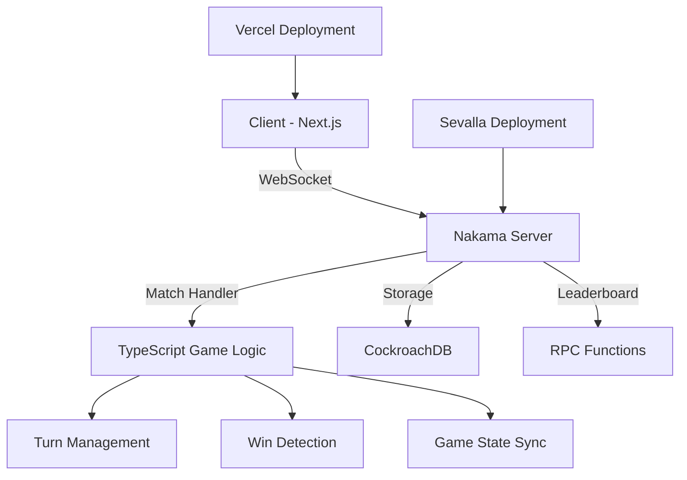

"# LILA Tic-Tac-Toe

A modern, multiplayer Tic-Tac-Toe game built with Next.js and Nakama, featuring server-authoritative gameplay, real-time matchmaking, and a comprehensive leaderboard system.

## 🚀 **Live Demo**

- **Game URL**: [Deploy to your Vercel URL]
- **Server Console**: [Your Sevalla Nakama Console URL]

## 📋 **Assignment Requirements Completed**

✅ **Server-authoritative multiplayer** - Game state managed entirely by Nakama server  
✅ **Matchmaking system** - Real-time player matching with queue management  
✅ **Cloud deployment ready** - Configured for Vercel (frontend) and Sevalla (backend)  
✅ **Multiple simultaneous games** - Architecture supports concurrent matches  
✅ **Leaderboard system** - Player rankings, stats, and achievements  

## 🏗️ **Architecture Overview**



### **Technology Stack**

**Frontend:**
- Next.js 15 with TypeScript
- Tailwind CSS for styling
- Nakama JS SDK for real-time communication
- React hooks for state management

**Backend:**
- Nakama 3.20.0 server
- Custom TypeScript match handler
- CockroachDB for data persistence
- Docker containerization

**Deployment:**
- Vercel for frontend hosting
- Sevalla for Nakama server hosting
- Environment-based configuration

## 🎮 **Game Features**

### **Core Gameplay**
- **Real-time multiplayer**: Instant move synchronization
- **Turn-based mechanics**: Server enforces valid turns
- **Win condition detection**: Automatic game ending and winner declaration
- **Visual feedback**: Highlighted last moves and turn indicators

### **Matchmaking**
- **Quick match**: Find opponents instantly
- **Game lobbies**: 2-player matches with automatic pairing
- **Connection handling**: Graceful disconnect management

### **Leaderboard & Stats**
- **Global leaderboard**: Rankings based on rating system
- **Player statistics**: Win/loss records, win rates, total games
- **Achievement system**: Unlockable badges and milestones
- **Rating system**: ELO-style rating calculations

## 🚧 **Local Development Setup**

### **Prerequisites**
- Node.js 18+ and npm
- Docker Desktop
- Git

### **1. Clone the Repository**
```bash
git clone <your-repo-url>
cd LILA
```

### **2. Start the Backend (Nakama Server)**
```bash
cd server
docker-compose up --build
```

This will start:
- Nakama server on `localhost:7350` (HTTP) and `localhost:7351` (Console)
- CockroachDB on `localhost:26257`
- Auto-compile TypeScript match handler

### **3. Setup the Frontend**
```bash
cd client
npm install
cp .env.example .env.local
npm run dev
```

Frontend will be available at `http://localhost:3000`

### **4. Test the Game**
1. Open two browser tabs to `http://localhost:3000`
2. Click "Find Match" in both tabs
3. Players will be matched and can play in real-time
4. Check leaderboard for stats (mock data in development)

## 🌐 **Production Deployment**

### **Backend Deployment (Sevalla)**

1. **Build the Match Handler:**
   ```bash
   # Windows
   deployment/build-server.bat
   
   # Linux/Mac
   ./deployment/build-server.sh
   ```

2. **Deploy to Sevalla:**
   - Create new Nakama service on [sevalla.com](https://sevalla.com)
   - Upload files from `server/typescript/build/`
   - Configure JavaScript runtime: `/nakama/data/modules/index.js`
   - Note your connection details

### **Frontend Deployment (Vercel)**

1. **Push to GitHub:**
   ```bash
   git add .
   git commit -m "Ready for deployment"
   git push origin main
   ```

2. **Deploy on Vercel:**
   - Connect GitHub repo to Vercel
   - Set environment variables:
     - `NEXT_PUBLIC_NAKAMA_HOST`: Your Sevalla host
     - `NEXT_PUBLIC_NAKAMA_PORT`: `7350`
     - `NEXT_PUBLIC_NAKAMA_SERVER_KEY`: `defaultkey`
     - `NEXT_PUBLIC_NAKAMA_USE_SSL`: `true`
   - Deploy!

## � **Production Deployment**

### **Complete Sevalla Deployment (Frontend + Backend)**

Deploy the entire application to Sevalla with one command:

```bash
# Windows
deploy-sevalla.bat

# Linux/Mac
chmod +x deploy-sevalla.sh
./deploy-sevalla.sh
```

This will:
1. Build the TypeScript match handler
2. Build the Next.js frontend for production
3. Create a deployment package with all necessary files
4. Generate environment configuration templates

**Manual Deployment Steps:**

1. **Prepare Environment Variables**
   ```bash
   # Edit .env.sevalla with your production values
   NAKAMA_HOST=your-app.sevalla.com
   NAKAMA_SERVER_KEY=your-secure-32-char-key
   NAKAMA_CONSOLE_USERNAME=admin
   NAKAMA_CONSOLE_PASSWORD=your-secure-password
   ```

2. **Deploy via Sevalla CLI**
   ```bash
   npm install -g @sevalla/cli
   sevalla login
   sevalla deploy --compose docker-compose.sevalla.yml
   ```

3. **Deploy via Sevalla Dashboard**
   - Upload `docker-compose.sevalla.yml`
   - Set environment variables
   - Deploy

**Post-deployment URLs:**
- Game: `https://your-app.sevalla.com`
- Admin Console: `https://your-app.sevalla.com:7351`
- API: `https://your-app.sevalla.com:7350`

### **Alternative: Separate Deployments**

**Frontend (Vercel):**
```bash
cd client
vercel deploy --prod
```

**Backend (Sevalla):**
```bash
cd deployment
# Follow sevalla-complete-deployment.md guide
```

## 🔧 **Development Workflow**

### **Environment Variables**
```env
# Development (.env.local)
NEXT_PUBLIC_NAKAMA_HOST=127.0.0.1
NEXT_PUBLIC_NAKAMA_PORT=7350
NEXT_PUBLIC_NAKAMA_SERVER_KEY=defaultkey
NEXT_PUBLIC_NAKAMA_USE_SSL=false

# Production (Vercel)
NEXT_PUBLIC_NAKAMA_HOST=your-service.sevalla.com
NEXT_PUBLIC_NAKAMA_PORT=7350
NEXT_PUBLIC_NAKAMA_SERVER_KEY=defaultkey
NEXT_PUBLIC_NAKAMA_USE_SSL=true
```

## 📁 **Project Structure**

```
LILA/
├── client/                 # Next.js frontend
│   ├── app/
│   │   ├── page.tsx       # Main game interface
│   │   ├── leaderboard.tsx # Stats & leaderboard
│   │   ├── nakama.ts      # Nakama client config
│   │   └── globals.css    # Styles
│   ├── .env.example       # Environment template
│   └── vercel.json        # Deployment config
├── server/
│   ├── docker-compose.yml # Local development
│   └── typescript/
│       ├── src/
│       │   ├── index.ts   # Match handler logic
│       │   └── types.d.ts # Type definitions
│       ├── Dockerfile     # Build container
│       └── package.json   # Dependencies
├── deployment/
│   ├── build-server.*     # Build scripts
│   ├── sevalla-config.md  # Server setup guide
│   └── README.md          # Deployment instructions
└── README.md              # This file
```

## 🎯 **Game Logic Implementation**

### **Server-Authoritative Design**
- All game state managed by Nakama server
- Client sends move intentions, server validates and broadcasts
- No client-side game logic to prevent cheating
- Real-time synchronization via WebSocket

### **Match Flow**
1. **Matchmaking**: Players join queue, server pairs them
2. **Game Start**: Server creates match, assigns X/O symbols
3. **Gameplay**: Turn-based moves with server validation
4. **Game End**: Win detection, stats update, leaderboard refresh

### **Key Features**
- **Turn validation**: Only current player can make moves
- **Board validation**: Prevent invalid moves (occupied squares)
- **Win detection**: Check all winning combinations after each move
- **Disconnect handling**: End game gracefully when player leaves

## 🏆 **Design Decisions**

### **Why Next.js?**
- Server-side rendering for better SEO and performance
- Built-in optimizations and production-ready features
- Excellent TypeScript support
- Easy Vercel deployment

### **Why Nakama?**
- Purpose-built for real-time multiplayer games
- Handles matchmaking, lobbies, and real-time communication
- Scalable cloud architecture
- Rich feature set (leaderboards, social, etc.)

### **Why TypeScript Match Handler?**
- Type safety for game logic
- Better development experience
- Easier debugging and maintenance
- Familiar syntax for web developers

## 🔍 **Testing & Verification**

### **Local Testing Checklist**
- [ ] Start server with `docker-compose up`
- [ ] Start client with `npm run dev`
- [ ] Open two browser tabs
- [ ] Both can connect and authenticate
- [ ] Matchmaking pairs players correctly
- [ ] Game board updates in real-time
- [ ] Win conditions work properly
- [ ] Leaderboard displays data

### **Production Testing**
- [ ] Frontend deploys successfully on Vercel
- [ ] Backend deploys successfully on Sevalla
- [ ] Environment variables configured correctly
- [ ] Cross-browser compatibility
- [ ] Mobile responsiveness
- [ ] Real-time sync under load

## 🐛 **Troubleshooting**

### **Common Issues**

**"Connection failed"**
- Check Nakama server is running (`docker-compose up`)
- Verify environment variables in `.env.local`
- Check browser console for detailed errors

**"Matchmaking timeout"**
- Ensure multiple clients are searching
- Check server logs for match handler errors
- Verify TypeScript compilation succeeded

**"Game state not syncing"**
- Check WebSocket connection in browser dev tools
- Verify match handler is loaded in Nakama console
- Look for JavaScript errors in server logs

## 📚 **API Reference**

### **Client Events**
- `GAME_STATE` (opcode 1): Receive updated game state
- `MOVE` (opcode 2): Send player move
- `GAME_OVER` (opcode 3): Game completion notification
- `ERROR` (opcode 4): Error messages

### **RPC Functions**
- `get_leaderboard`: Fetch global rankings
- `get_player_stats`: Get individual player statistics
- `update_player_stats`: Update stats after game

## 🤝 **Contributing**

1. Fork the repository
2. Create a feature branch: `git checkout -b feature-name`
3. Make changes and test locally
4. Commit: `git commit -m "Add feature"`
5. Push: `git push origin feature-name`
6. Create Pull Request

## 📄 **License**

This project is created for the LILA Engineering assignment.

## 👨‍💻 **Author**

Created as part of the LILA Engineering technical assessment.

---

**Ready to play? Deploy the game and challenge your friends to a match!** 🎮
" 
